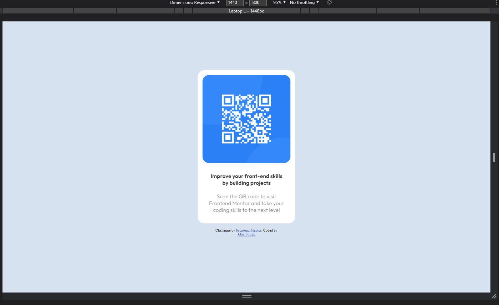
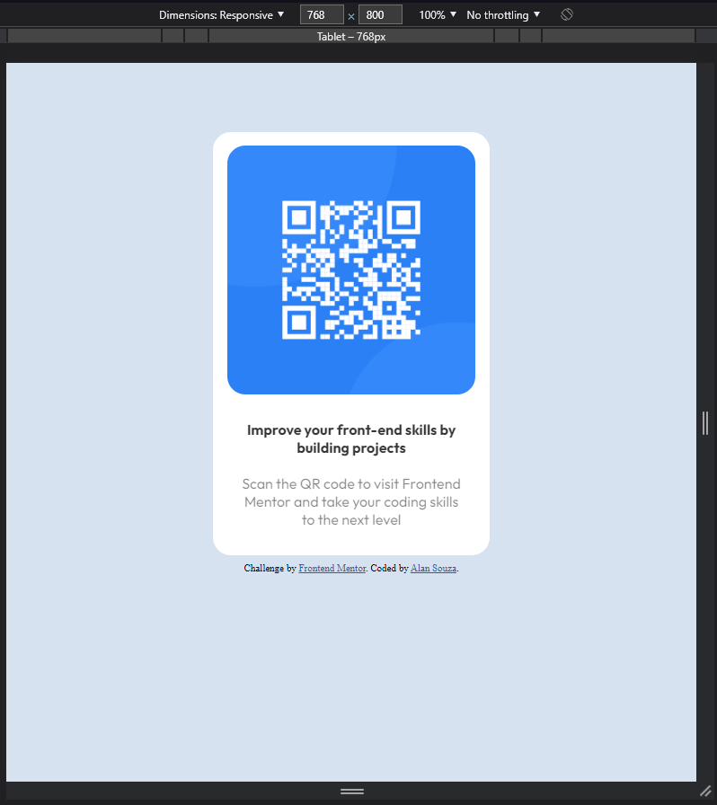
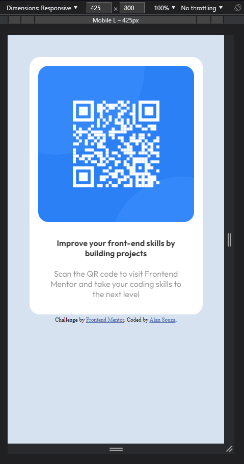
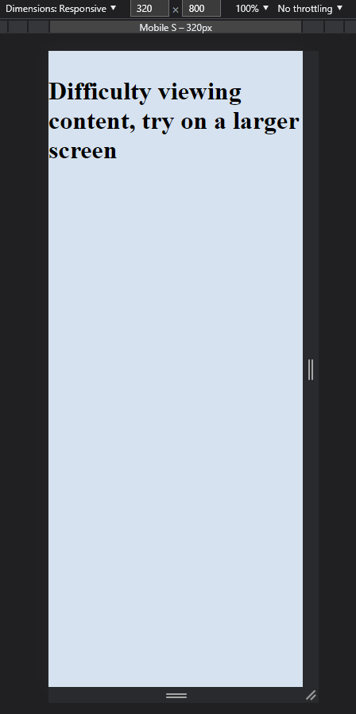
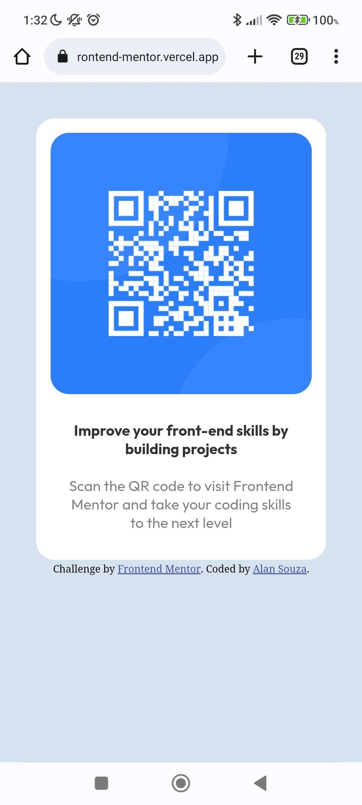

# Frontend Mentor - QR code component solution

This is a solution to the [QR code component challenge on Frontend Mentor](https://www.frontendmentor.io/challenges/qr-code-component-iux_sIO_H). Frontend Mentor challenges help you improve your coding skills by building realistic projects. 

## Table of contents

- [Overview](#overview)
  - [Screenshot](#screenshot)
  - [Links](#links)
- [My process](#my-process)
  - [Built with](#built-with)
  - [What I learned](#what-i-learned)
  - [Continued development](#continued-development)
- [Author](#author)
- [Acknowledgments](#acknowledgments)

## Overview
Some basic information about the project:

### Screenshot
Some screenshots of the project and a simple warning message to try accessing the site on another device if the content is not displayed.

1440px    
768px   
425px   
320px   
Mobile   

### Links

- Solution URL: [Solution URL](https://your-solution-url.com)
- Live Site URL: [Live site on Vercel.app](https://alan-qr-code-frontend-mentor.vercel.app)

## My process

### Built with

- HTML5
- CSS and SCSS
- Visual Studio Code (1.76.0)

### What I learned

This was my first contact with SCSS and this simple challenge made me get up the courage to test and build, now I'm going to use SCSS for more future projects as I find it very clean to understand and reorganize

### Continued development

I think the only changes or updates to be made with this project are about the design, maybe changing the size or something.

## Author

- Frontend Mentor - [@AlanS3103](https://www.frontendmentor.io/profile/AlanS3103)
- Twitter - [@Alan_S3103](https://www.twitter.com/Alan_S3103)

## Acknowledgments

First I want to thank my friend for introducing me to the Frontend Mentor website and for suggesting me some challenges to improve my skills, he highly recommended the website as it has simple and complex challenges, and now I am following his tip and having a lot of fun.
